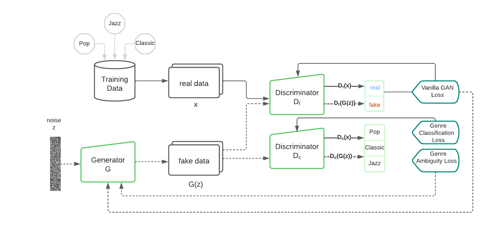

# Creating Music with GAN

As final project of the Course "Implementing Artificial Neural Networks with Tensorflow" at the University of Osnabrueck we implemented a Creative Adversarial Network that is able to generate music that cannot directly be traced back to the music genres available in the training data. The project is based on the work of [Nao Tokui](https://arxiv.org/abs/2011.13062#:~:text=%2D%2D%20Generating%20novel%20rhythm%20patterns%20using%20GAN%20with%20Genre%20Ambiguity%20Loss,-Nao%20Tokui&text=The%20paper%20shows%20that%20our,genres%20in%20the%20training%20dataset) who used a Creative Adversarial Network to generate new electronic dance music genres. Our model was trained with pop, jazz and classic music. The preprocessed dataset we used can be found in [] directory. However, the model could also be trained with other music genres.
For further information please refer to our [paper]().

# Dataset
We used the following datasets. They all contain music in MIDI file format.

- [Pop Dataset](https://github.com/music-x-lab/POP909-Dataset): This dataset also contains several other genres that might be interesting for further purposes [@pop909-ismir2020]
- [Jazz Dataset](https://github.com/lucasnfe/adl-piano-midi) [@ferreira_aiide_2020]
- [Classic Dataset](https://www.kaggle.com/datasets/soumikrakshit/classical-music-midi) 

This dataset also contains several other genres that might be interesting for further 

  

# Listen to a generated sample

<audio controls="1" controlslist="nodownload nofullscreen noremoteplayback" src="C:\Users\jule-\Documents\Uni\IANNwtf\final_project\sound.mp3.mp3">Your browser does not support the audio tag.</audio>

# Usage

# Technologies
Project was created with:
* Python version: 3.6
* Tensorflow version: 2.8.0
* pretty_midi version: 0.2.9

# References

